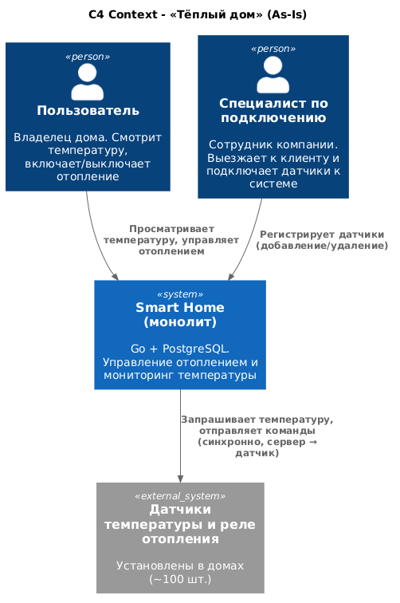
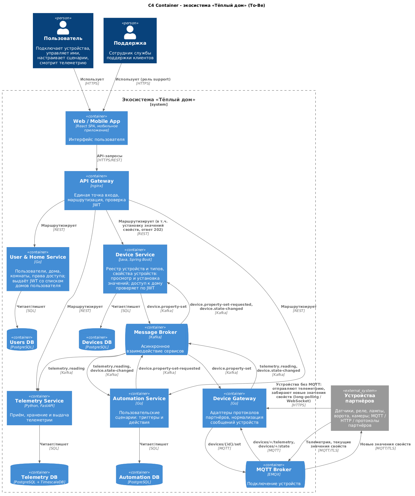
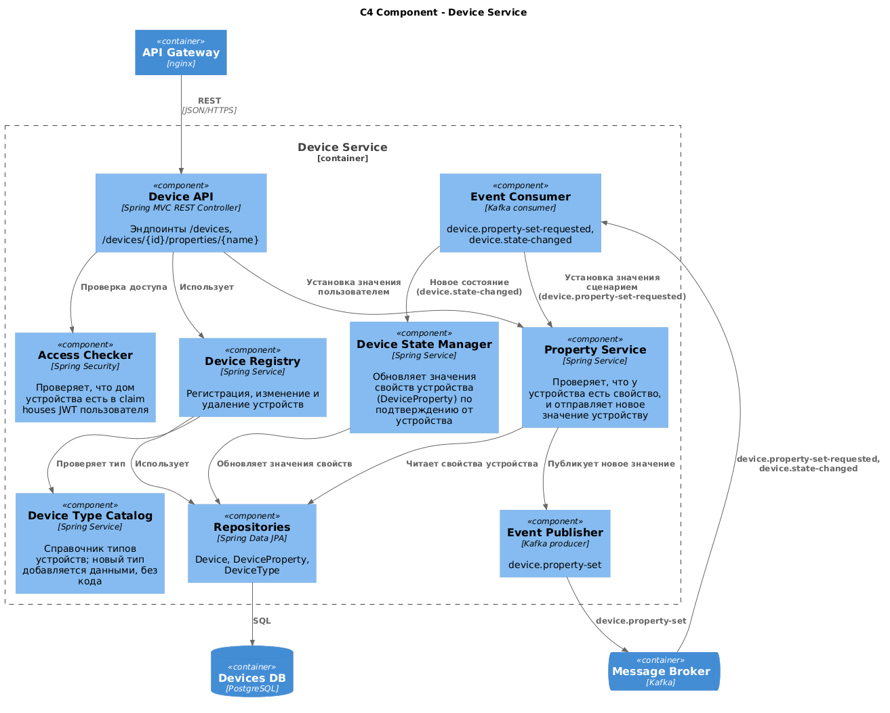
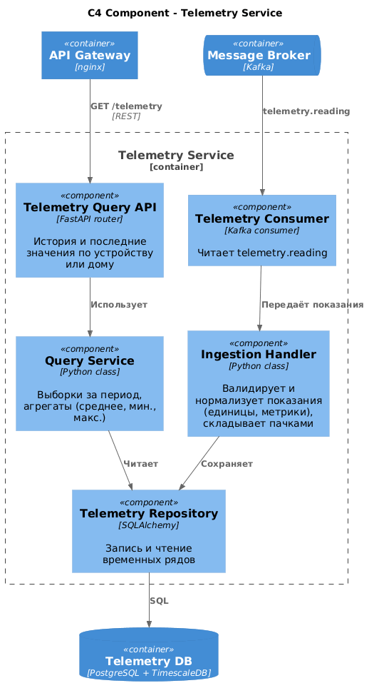
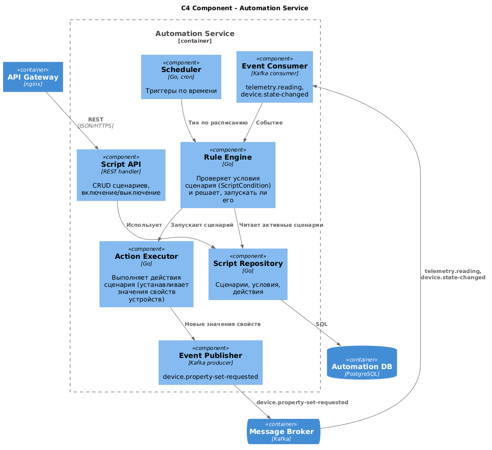
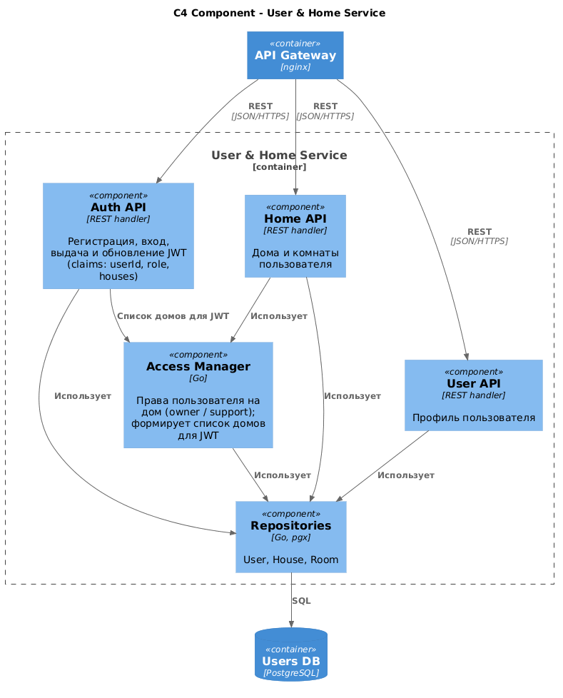
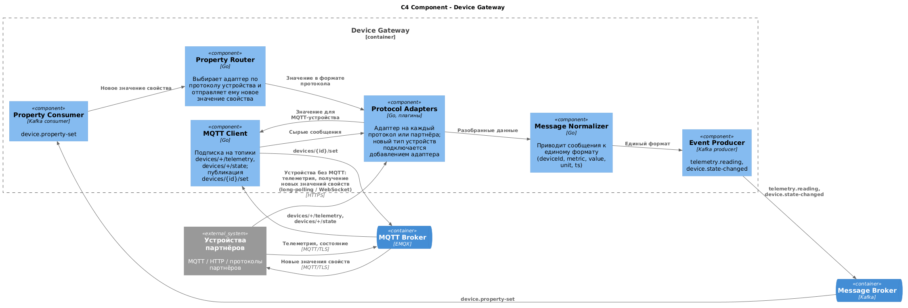
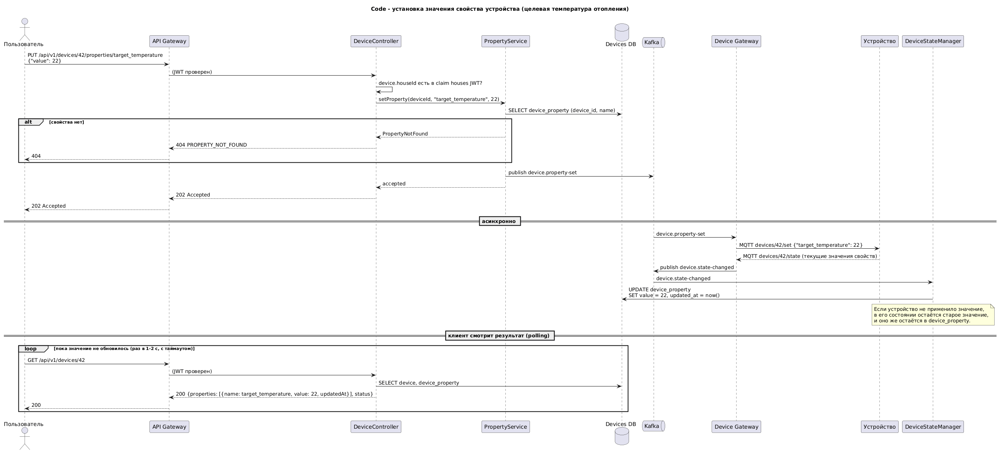
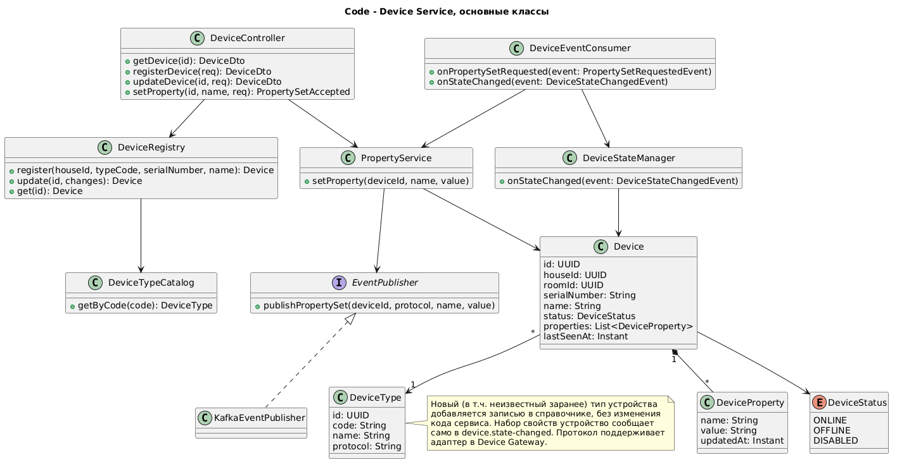
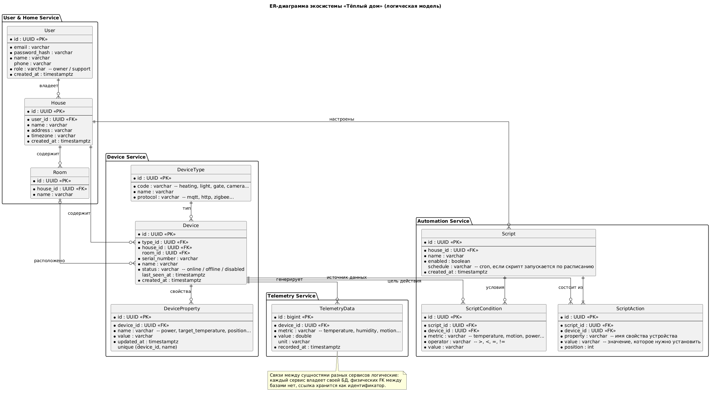

# Project_template

Проектная работа 1 спринта.

- Запуск описан в [apps/README.md](apps/README.md);
- Все схемы (в том числе swagger, asyncapi) лежат в schemas/*;

# Задание 1. Анализ и планирование

### 1. Описание функциональности монолитного приложения

**Работа с устройствами:**

- Сотрудник компании может добавить/удалить конечное устройство (сенсор в терминологии приложения).
- Система поддерживает добавление/удаление конечных устройств (сенсор в терминологии приложения).

**Управление отоплением:**

- Пользователи могут удалённо включать/выключать отопление в своих домах (синхронная операция).
- Пользователи могут удалённо задавать целевую температуру отопления в своих домах (синхронная операция).
- Система поддерживает функционал включения/выключения отопления на конечных устройствах в домах пользователя. Синхронная операция Сервер -> Устройство.
- Система поддерживает установку целевой температуры на конечных устройствах в домах пользователя. Синхронная операция Сервер -> Устройство.

**Мониторинг температуры:**

- Пользователи могут просматривать текущую температуру в своих домах через веб-интерфейс.
- Система поддерживает функционал опроса устройств. Синхронная операция Сервер -> Устройство.

### 2. Анализ архитектуры монолитного приложения

- Монолит smart_home, написанный на Golang;
- Упаковка приложения в Docker;
- База данных - Postgres;
- Первичная инициализация БД с помощью init.sql (с дополнительной настройкой);
- Конфигурация через переменные окружения;
- Запуск и управление контейнерами - Docker Compose;
- Вспомогательный скрипт для запуска приложения - init.sh.

### 3. Определение доменов и границы контекстов

**As-Is**

- Heating Domain: один контекст внутри монолита, который объединяет управление отоплением, мониторинг температуры
  и учёт датчиков (сущность `Sensor`).

**To-Be**

Домены и субдомен описаны с учетом новых требований к системе (To Be).

- Smart Home Domain
  - User Management Subdomain: регистрация и профиль пользователя.
  - Home Management Subdomain: дома и комнаты пользователя, привязка устройств к дому.
  - Device Management Subdomain: реестр устройств и их типов, свойства устройств (просмотр и установка значений)
    (отопление, свет, ворота, камеры - это типы устройств).
  - Device Integration Subdomain: подключение устройств партнёров по стандартным протоколам (MQTT, HTTP и т.д.),
    адаптеры протоколов. Через него подключаются новые, заранее неизвестные датчики.
  - Automation Subdomain: пользовательские сценарии (триггер → действия).
  - Telemetry Subdomain: сбор, хранение и просмотр телеметрии.
  - Security Subdomain: аутентификация, авторизация, права доступа к дому.
  - Support Subdomain: инструменты службы поддержки клиентов.

Device Management Subdomain, вероятно, слишком крупный модуль. Сейчас он подразумевает работу с устройствами
(добавление, управление, удаление, прошивка). В реальном проекте нужно рассмотреть дробление данного субдомена на
более мелкие части.

Также можно рассмотреть дополнительный вектор группировки: Core, Supporting, Generic.

### **4. Проблемы монолитного решения**

Если говорить о целевой To Be архитектуре, домены которой описаны в предыдущем шаге, с монолитным приложением мы столкнемся с большим количеством проблем:

- В монолитном решении всё приложение умного дома (backend) является единицей деплоя, в таком случае, если появится задача, к примеру, поддержать новый тип устройств, обновлять придётся всю систему. В микросервисной архитектуре мы бы обновили только затронутые сервисы.
- В монолитном решении, если какой-то высоконагруженный компонент (к примеру Telemetry) может уронить и потащить за собой (т.к. это одно приложение) важные компоненты, такие как Security и Automation.
- В монолитном решении мы не можем отдельно масштабировать высоконагруженные части, к примеру Telemetry.
- В монолитном решении мы не можем отдельно релизить затронутые части (к примеру, при поддержке новых протоколов или добавлении новых видов условий в сценарии).
- В монолитном решении легче получить спагетти-код, если код организован неправильно и не разбит на модули в репозитории.
- В рамках монолита мы ограничены 1-м языком программирования, при этом для разных задач лучше подходят свои языки.
- Если посмотреть на домены в To Be, то мы получаем уже довольно большой проект, если продолжать реализовывать его как монолит, вход новых сотрудников в проект значительно усложнится из-за объёма кодовой базы.

### 5. Визуализация контекста системы - диаграмма С4

Исходник: [schemas/c4/context/context-as-is.puml](schemas/c4/context/context-as-is.puml)

# Задание 2. Проектирование микросервисной архитектуры

Домены As-Is и To-Be и соответствие субдоменов сервисам описаны в Задании 1, п.3.

Ключевые решения:

- Отопление, свет, ворота и камеры не выделены в отдельные сервисы, это типы устройств и свойств в одном Device Service.
- Устройством управляют через его свойства: состояние - это набор свойств со значениями (`power = on`,
  `target_temperature = 22`), а управление - установка нового значения свойства. Отдельных команд нет.
- Устройства подключаются к MQTT-брокеру и сами отправляют телеметрию (push), сервер их не опрашивает (в реальном проекте они были бы спрятаны еще и за NAT как правило).
- Путь записи (установка значения свойства): пользователь → API Gateway → Device Service (REST, ответ `202`)
  → Kafka `device.property-set` → Device Gateway → MQTT → устройство. Устройство подтверждает новое значение
  событием `device.state-changed`, и только тогда Device Service обновляет значение свойства.
- Путь чтения (телеметрия): устройство → MQTT → Device Gateway → Kafka `telemetry.reading` → Telemetry и Automation Service.
- Устройства сами открывают соединение с облаком (MQTT, либо HTTPS long-polling / WebSocket для устройств без MQTT),
  поэтому NAT на стороне дома не мешает.
- У каждого сервиса своя БД.

**Диаграмма контейнеров (Containers)**

Исходник: [schemas/c4/containers/containers-to-be.puml](schemas/c4/containers/containers-to-be.puml)

**Диаграмма компонентов (Components)**

Device Service: [schemas/c4/components/components-device-service.puml](schemas/c4/components/components-device-service.puml)

Telemetry Service: [schemas/c4/components/components-telemetry-service.puml](schemas/c4/components/components-telemetry-service.puml)

Automation Service: [schemas/c4/components/components-automation-service.puml](schemas/c4/components/components-automation-service.puml)

User & Home Service: [schemas/c4/components/components-user-home-service.puml](schemas/c4/components/components-user-home-service.puml)

Device Gateway: [schemas/c4/components/components-device-gateway.puml](schemas/c4/components/components-device-gateway.puml)

**Диаграмма кода (Code)**

Установка значения свойства устройства (sequence): [schemas/c4/code/code-set-property-sequence.puml](schemas/c4/code/code-set-property-sequence.puml)

Основные классы Device Service: [schemas/c4/code/code-device-service-classes.puml](schemas/c4/code/code-device-service-classes.puml)

**План перехода к целевой системе (Strangler Fig)**

1. Перед монолитом ставится API Gateway, весь трафик идёт через него;
2. Telemetry Service встаёт между монолитом и датчиками и начинает накапливать историю телеметрии;
3. Device Service запускается для новых типов устройств (свет, ворота, камеры), а Gateway направляет `/devices` в него (сделано в MVP);
4. Запускаются User & Home Service и аутентификация, пользователи и дома создаются для текущих 100 клиентов;
5. Запускаются MQTT Broker, Device Gateway и Kafka. Устройства начинают отправлять телеметрию сами (push);
6. Датчики и модули отопления из таблицы `sensors` переносятся в Device Service, Gateway переключает `/sensors` на новые сервисы;
7. Запускается Automation Service (сценарии);
8. Монолит выводится из эксплуатации.

# Задание 3. Разработка ER-диаграммы

Исходник: [schemas/er/er-diagram.puml](schemas/er/er-diagram.puml)

Сущности:

| Сущность       | Сервис              | Назначение |
|----------------|---------------------|------------|
| User           | User & Home         | Пользователь (владелец дома или сотрудник поддержки) |
| House          | User & Home         | Дом пользователя |
| Room           | User & Home         | Комната в доме (расположение устройства) |
| DeviceType     | Device              | Тип устройства и протокол |
| Device         | Device              | Устройство и его статус (online/offline/disabled) |
| DeviceProperty | Device              | Свойство устройства и его значение (power = on, target_temperature = 22). Пользователь и сценарии читают и меняют состояние устройства через значения свойств |
| TelemetryData  | Telemetry           | Показание устройства (метрика, значение, время) |
| Script         | Automation          | Пользовательский сценарий (опционально с расписанием) |
| ScriptCondition| Automation          | Условие запуска сценария по показанию или состоянию устройства (например, температура < 18) |
| ScriptAction   | Automation          | Действие сценария: установить значение свойства устройства (target_temperature = 22) |

Связи:

- User - House: один ко многим (у пользователя может быть несколько домов, у дома один владелец).
- House - Room, House - Device, House - Script: один ко многим.
- Room - Device: один ко многим, связь необязательная (устройство может быть без комнаты).
- DeviceType - Device: один ко многим.
- Device - DeviceProperty: один ко многим, одна запись на свойство (уникальны device_id + name).
- Device - TelemetryData: один ко многим.
- Script - ScriptCondition: один ко многим (условия объединяются по И; сценарий без условий запускается
  только по расписанию). Device - ScriptCondition: один ко многим.
- Script - ScriptAction: один ко многим (в сценарии минимум одно действие). Device - ScriptAction: один ко многим.

Связи между сущностями разных сервисов логические - у каждого сервиса своя БД, ссылка хранится как идентификатор,
без физического внешнего ключа, сервисы имеют доступ только к своей БД.

# Задание 4. Создание и документирование API

### 1. Тип API

- **REST (OpenAPI)** для синхронных запросов, когда клиенту (UI через API Gateway или другому сервису) нужен ответ сразу:
  регистрация и получение устройства, установка значения свойства устройства, чтение истории телеметрии.
- **AsyncAPI (Kafka)** для событий, которые не требуют немедленного ответа и могут иметь несколько потребителей:
  новые показания телеметрии, установка значений свойств сценариями, доставка новых значений устройствам,
  изменение состояния устройства. Такая схема развязывает
  сервисы и сглаживает пиковую нагрузку от устройств.

Установка значения свойства объединяет оба подхода: REST-запрос возвращает `202 Accepted`,
а доставка и подтверждение от устройства идут асинхронно; клиент видит новое значение, опрашивая устройство.

В реальном проекте имеет смысл рассмотреть WS для взаимодействия с клиентами, но это усложнит работу.
WS-коннект нужно держать постоянно, нужно распределять коннекты между несколькими нодами, нужно знать какая нода держит какой 
коннект, чтобы взаимодействовать с ним, задача выходит за рамки спринта.

### 2. Документация API

- Device Service (REST): [schemas/api/device-service.openapi.yaml](schemas/api/device-service.openapi.yaml)
  - `POST /devices` - регистрация устройства
  - `GET /devices/{deviceId}` - информация об устройстве и текущие значения его свойств
  - `PATCH /devices/{deviceId}` - обновление настроек устройства
  - `PUT /devices/{deviceId}/properties/{name}` - установка значения свойства устройства (ответ `202`)

  Отдельных эндпоинтов «обновить состояние» и «отправить команду» нет: оба сценария - это установка значения
  свойства. Например, «включить отопление» - `PUT /devices/{id}/properties/power` с `{"value": "on"}`,
  «задать температуру» - `PUT /devices/{id}/properties/target_temperature` с `{"value": 22}`.
- Telemetry Service (REST): [schemas/api/telemetry-service.openapi.yaml](schemas/api/telemetry-service.openapi.yaml)
  - `GET /telemetry/devices/{deviceId}` - история телеметрии устройства за период
- События (AsyncAPI): [schemas/api/events.asyncapi.yaml](schemas/api/events.asyncapi.yaml)
  - `telemetry.reading`, `device.property-set-requested`, `device.property-set`, `device.state-changed`

# Задание 5. Работа с docker и docker-compose

- [apps/temperature_api](apps/temperature_api): эмулятор датчика на Python (FastAPI), порт 8081.
  `GET /temperature?location=` и `GET /temperature/{sensor_id}` при каждом вызове возвращают случайную температуру.
  Сопоставление location и sensorId сделано как в примере из задания.
- [apps/docker-compose.yml](apps/docker-compose.yml): добавлены `temperature-api` и `postgres`
  с инициализацией через `./smart_home/init.sql`.

# Задание 6. Разработка MVP

Новые сервисы:

- [apps/device_service](apps/device_service): **Device Service** на Java 25 (Spring Boot 4), порт 8082.
  Регистрация устройств любого типа, просмотр и установка значений их свойств (`PUT /api/v1/devices/{id}/properties/{name}`).
- [apps/telemetry_service](apps/telemetry_service): **Telemetry Service** на Python (FastAPI), порт 8083.
  Хранит историю показаний и выдаёт её по `GET /api/v1/telemetry/{sensorId}`, принимает показания по `POST /api/v1/telemetry`.
- [apps/gateway](apps/gateway): **API Gateway** на nginx, порт 8000.

Интеграция с монолитом (Strangler Fig, без изменения логики монолита):

- API Gateway (nginx) направляет `/api/v1/devices` в Device Service, `/api/v1/telemetry` - в Telemetry Service,
  а всё остальное (`/api/v1/sensors`) - в монолит. Переносить функциональность можно маршрут за маршрутом.
- `TEMPERATURE_API_URL` монолита указывает на Telemetry Service. Telemetry Service реализует тот же контракт,
  что и temperature-api (`/temperature/{id}`, `/temperature?location=`): опрашивает датчик и сохраняет каждое показание
  в историю. Монолит получает температуру как раньше, а история телеметрии уже копится в новом сервисе.
- Device Service → монолит: датчик температуры (`type: temperature`), зарегистрированный в Device Service, дублируется
  в монолит через `POST /api/v1/sensors`, в ответе устройства это `legacySensorId`. Пока клиенты работают со старым API
  `/sensors`, они видят новые датчики, а их температура идёт через Telemetry Service. Если монолит недоступен,
  устройство всё равно регистрируется, только без `legacySensorId`.

Упрощения MVP по сравнению с To-Be (т.к. время спринта сильно ограничено): 

- синхронное HTTP-взаимодействие без Kafka и MQTT;
- хранение в памяти сервисов (без отдельных БД);
- без аутентификации.
